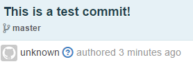

# whodidgit
Who did git?
Figure out who the committed that unknown commit!

## This sucks



## Let's fix it

This is a very simple node server that uses the GitHub API to get more information about a specific commit.

## Example

```shell
curl http://whodidgit.herokuapp.com?owner=shakeelmohamed&repo=whodidgit&sha=c977b473efb8d1fa3bede0171b005bb4c00c1561
```

The above will return something like:
FIXME!!!
```json

```